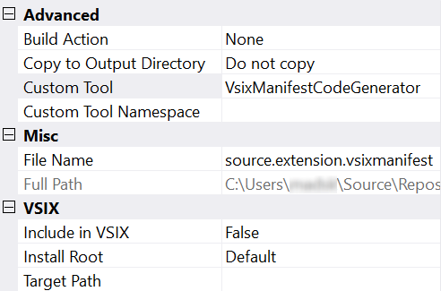

# Single File Generator sample

[](https://ci.appveyor.com/project/madskristensen/singlefilegeneratorsample)

**Applies to Visual Studio 2015 and newer**

This example shows how to write a Single File Generator in a Visual Studio extension that will output a nested file when the parent file is modified.

Clone the repo to test out the sample in Visual Studio 2017 yourself.

## What is a Single File Generator
It is also known as a Custom Tool which can be manually set in the properties of supported files.



The most well-known examples of exising generators are the ones creating a strongly typed C#/VB nested file for .resx files.

Every time the file with the Custom Tool property is modified, the Single File Generator will execute to update the nested file. 

The nested file can be of any type - code, images, etc. - the sky is the limit.

## Let's get started
This example contains 2 components. 

1. A command you can click that will add the Custom Tool property
2. The Single File Generator C# class

So before we begin, make sure you have created a VSIX project in Visual Studio. [See how here](https://docs.microsoft.com/en-us/visualstudio/extensibility/extensibility-hello-world).

### Install NuGet package
The base classes for the Single File Generator are located in the [Microsoft.VisualStudio.TextTemplating.VSHost.15.0](https://www.nuget.org/packages/Microsoft.VisualStudio.TextTemplating.VSHost.15.0/) NuGet package, so go ahead and install that into your VSIX project.

### The generator
The generator is a simple class that inherits from the *BaseCodeGeneratorWithSite* and looks like this:

```c#
using Microsoft.VisualStudio.TextTemplating.VSHost;

[Guid("82ca81c8-b507-4ba1-a33d-ff6cdad20e36")] // change this
public sealed class MyCodeGenerator : BaseCodeGeneratorWithSite
{
  public const string Name = nameof(MyCodeGenerator);
  public const string Description = "The description";
}

public override string GetDefaultExtension() => ".cs";

protected override byte[] GenerateCode(string inputFileName, string inputFileContent)
{
  var text = "// the output";
  return Encoding.UTF8.GetBytes(text);
}
```

[See full generator class in the source](src/Generators/MinifyGenerator.cs).

That's it, you now have a Single File Generator that writes a .cs file with the content `// the output`. Now we must register it.

### Registering the generator
Decorate your *Package* class with the `ProvideCodeGenerator` attribute.

```c#
[ProvideCodeGenerator(typeof(MyCodeGenerator), MyCodeGenerator.Name, MyCodeGenerator.Description, true)]
public sealed class VSPackage : AsyncPackage
```

[See full Package class in the source](src/VSPackage.cs).

Now the generator is registered, and you can now manually add give the Custom Tool property on files the *MyCodeGenerator* value. However, it would be much easier if we give our users a command in the context-menu of files in Solution Explorer to add the value for them.

### Add the command button
In the .VSCT file you must specify a new button. It could look like this:

```c#
<Button guid="guidPackageCmdSet" id="ApplyCustomToolId" priority="0x0100" type="Button">
  <Parent guid="guidSHLMainMenu" id="IDG_VS_CTXT_ITEM_INCLUDEEXCLUDE"/>
  <Strings>
    <ButtonText>Add My Generator</ButtonText>
  </Strings>
</Button>
```

[See full .vsct file in the source](src/VSCommandTable.vsct).

Then we need to add the command handler C# file. It will look similar to this:

```c#
internal sealed class ApplyCustomTool
{
    private const int _commandId = 0x0100;
    private static readonly Guid _commandSet = new Guid("4aaf93c0-70ae-4a4b-9fb6-1ad3997a9adf");
    private static DTE _dte;
    
    public static async Task InitializeAsync(AsyncPackage package)
    {
        _dte = await package.GetServiceAsync(typeof(DTE)) as DTE;

        var commandService = await package.GetServiceAsync((typeof(IMenuCommandService))) as IMenuCommandService;
        var cmdId = new CommandID(_commandSet, _commandId);
        commandService.AddCommand(cmd);
    }

    private static void OnExecute(object sender, EventArgs e)
    {
        ProjectItem item = _dte.SelectedItems.Item(1).ProjectItem;
        string ext = Path.GetExtension(item?.FileNames[1] ?? "")?.ToLowerInvariant();

        item.Properties.Item("CustomTool").Value = MinifyCodeGenerator.Name;
    }
}
```

[See full command handler in the source](src/Commands/ApplyCustomTool.cs).

And then finally initialize the command handler from the *Package* initialization method.

```c#
protected override async Task InitializeAsync(CancellationToken cancellationToken, IProgress<ServiceProgressData> progress)
{
    await ApplyCustomTool.InitializeAsync(this);
}
```

[See full Package class in the source](src/VSPackage.cs).

### Single File Generators in the wild
Here are more samples of open source extensions implementing Single File Generators.

* [VSIX Synchronizer](https://github.com/madskristensen/VsixSynchronizer)
* [Extensibility Tools](https://github.com/madskristensen/extensibilitytools)

## License
[Apache 2.0](LICENSE)